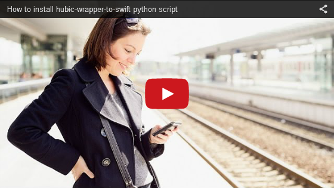

hubic-wrapper-to-swift
======================

This program is a command line client for OVH hubiC API and a wrapper for swift
client.

**This program is not developed, nor maintained by OVH. Use at your own risk!**

Requirements
------------

This is program is written in python and has only been tested on debian
wheezy. It relies on a few python libraries (requests, ...). Please
check hubic.py header for the complete list.

The following packages should be enough to make it work on Ubuntu 14.04
`apt-get install python-swift python-requests` or using [pip](https://github.com/pypa/pip) `pip install -r
requirements.txt`

You must [register an application](https://hubic.com/home/browser/developers/) in your hubiC account to access the hubiC API.

You will need a valid `client_id`, `client_secret` and `redirect_uri`.

`redirect_uri` can be any url accepted by OVH. This program does not actually
perform any connection to this url. If you don't know, use:

`http://localhost:8080/`

Usage
-----

### How to use video

### Get complete function list
    $ ./hubic.py --help

### Request a new access token
    $ ./hubic.py --token

hubic.py will load and store for hubiC credentials in the default config file
$HOME/.hubic.cfg unless otherwise specified.

    $ ./hubic.py --config my_hubic_config
    $ cat ~/.hubic.cfg
    [hubic]
    client_id = api_hubic_4b1dee31565ff182f98a05882fffbc8e
    client_secret = 95f642cfce603f2430c23a4106ce8ea55d85a972
    redirect_uri = http://localhost/
    username = my_hubic
    password = my_hubic_password
    [openstack]
    os_auth_token = ba8fb42dd1d7d3a5e3194d146cc9d699fd700ff2
    os_storage_url = https://lb1.hubic.ovh.net/v1/AUTH_c8aeff01cf8aaf653cdaa31

If not provided as environment variables or as command line arguments, the
program will request application and user credentials :

    HUBIC_CLIENT_ID=api_hubic_4b1dee31565ff182f98a05882fffbc8e  
    HUBIC_CLIENT_SECRET=95f642cfce603f2430c23a4106ce8ea55d85a972
    HUBIC_CLIENT_REDIRECT_URI=http://localhost/
    HUBIC_USERNAME=my_hubic
    HUBIC_PASSWORD=my_hubic_password

Please use the above variable names but replace values with your own
credentials.

hubic.py will then perform all authentification steps.
If succeed, you will get your own access and refresh token to the hubiC API.

    HUBIC_ACCESS_TOKEN=c9225cbbfe25ec72892e34ac3c6e61c3ee6b5c9259bd0a77e
    HUBIC_REFRESH_TOKEN=994fdf7deeb336988931a2df8602eb1cbe196b837fb02946d

### Request a new access token

Access token have a limited lifetime. You can get a new access token with your
refresh token:

    $ ./hubic.py --refresh
    HUBIC_ACCESS_TOKEN=b27245709f8cf1a2b81326a43bda140356b9836b55a232e15

### Request hubiC API

The complete list of [hubiC API is available here](https://api.hubic.com/console/)

To access hubiC API, just specify the type of request (--get, --post, --delete)
followed by the hubiC API name :

    $ ./hubic.py --get /account
    {"email":"mymail@gmail.com","firstname":"MyFirstName","activated":true,"creationDate":"2013-04-04T12:45:36+01:00","language":"en","status":"ok","offer":"25g","lastname":"MyLastName"}

If you want to perform a POST request, you can add URL encoded data with the
"--data" option (See https://docs.python.org/2/library/urllib.html#urllib.urlencode):

    $ ./hubic.py --post /account/links --data "comment=none&container=default&mode=ro&ttl=1&type=file&uri=%2Fmyshare.txt"

### Display currently used environment variables

This is useful if you encounter auth issues.

    $ ./hubic.py -v

### Use the swift client to access hubiC OpenStack

This program can act as a proxy to swift client.

    $ ./hubic.py --swift -- list default

All parameters provided after "--" are forwarded to swift client.  If
OS_AUTH_TOKEN and OS_STORAGE_URL are not already provided in the environment,
the program will request them using "/account/credentials" API

### Python 3 compatibility

`hubic.py` script is not compatible with python 3, use `hybic.py-3` instead.

Contact
-------

Please report any bug or enhancement requests to the [github project page](https://github.com/puzzle1536/hubic-wrapper-to-swift/issues?q=is%3Aopen+is%3Aissue)

License
-------

This program is free software: you can redistribute it and/or modify
it under the terms of the GNU General Public License as published by
the Free Software Foundation, either version 3 of the License, or
(at your option) any later version.

This program is distributed in the hope that it will be useful,
but WITHOUT ANY WARRANTY; without even the implied warranty of
MERCHANTABILITY or FITNESS FOR A PARTICULAR PURPOSE.  See the
GNU General Public License for more details.

You should have received a copy of the GNU General Public License
along with this program.  If not, see <http://www.gnu.org/licenses/>.
